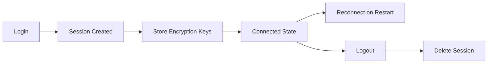

GOWA provides two layers of authentication: WhatsApp login (connecting your phone number) and API authentication (securing HTTP endpoints).

## WhatsApp authentication

### QR code login

Scan a QR code with your WhatsApp mobile app to link a device.

<Steps>
  <Step title="Generate QR code">
    Request a QR code for device login:
    
    ```bash cURL
    curl http://localhost:3000/devices/my-device/login
    ```
    
    Response:
    ```json
    {
      "code": 200,
      "message": "Success",
      "data": {
        "qr_code": "data:image/png;base64,iVBORw0KGgoAAAANS...",
        "qr_duration": 60
      }
    }
    ```
  </Step>

  <Step title="Scan QR code">
    On your phone:
    1. Open WhatsApp
    2. Tap **Menu** (⋮) or **Settings**
    3. Select **Linked Devices**
    4. Tap **Link a Device**
    5. Scan the QR code displayed in browser or API response
  </Step>

  <Step title="Connection established">
    After successful scan:
    - Device state changes to `connected`
    - Session keys stored in `storages/{jid}/session.db`
    - Device appears in your phone's "Linked Devices" list
  </Step>
</Steps>

<Note>
QR codes expire after **60 seconds**. Request a new QR if expired.
</Note>

### Pairing code login

Link device using an 8-digit pairing code (no QR scanning required).

<Steps>
  <Step title="Request pairing code">
    ```bash cURL
    curl -X POST http://localhost:3000/devices/my-device/login/code \
      -H "Content-Type: application/json" \
      -d '{"phone": "628123456789"}'
    ```
    
    Response:
    ```json
    {
      "code": 200,
      "message": "Success",
      "data": {
        "code": "ABCD-1234",
        "duration": 60
      }
    }
    ```
  </Step>

  <Step title="Enter code on phone">
    On your phone:
    1. Open WhatsApp
    2. Tap **Menu** → **Linked Devices** → **Link a Device**
    3. Tap **Link with phone number instead**
    4. Enter the 8-digit code (e.g., `ABCD-1234`)
  </Step>
</Steps>

<Tip>
Pairing codes are ideal for headless servers or when QR scanning is impractical.
</Tip>

### Which method to use?

| Scenario | Recommended Method |
|----------|-------------------|
| Local development with UI | QR Code |
| Headless server | Pairing Code |
| Automation scripts | Pairing Code |
| Mobile-first setup | QR Code |

## Session persistence

After successful login, session data is stored in SQLite:

```
storages/{jid}/session.db
```

Contains:
- Encryption keys (AES-256)
- Device identity certificates
- WhatsApp protocol state

<Warning>
**Never share session.db files** - they provide full access to your WhatsApp account.
</Warning>

### Session lifecycle



- **Reconnect**: Server restarts automatically restore sessions
- **Logout**: Explicitly invalidates session and removes from phone

## API authentication

Secure your HTTP endpoints with HTTP Basic Authentication.

### Enable basic auth

<Tabs>
  <Tab title="CLI Flag">
    ```bash
    ./whatsapp rest --basic-auth="admin:secret123"
    ```
  </Tab>
  <Tab title="Environment Variable">
    ```bash
    export APP_BASIC_AUTH="admin:secret123"
    ./whatsapp rest
    ```
  </Tab>
  <Tab title="Docker">
    ```bash
    docker run -p 3000:3000 \
      -e APP_BASIC_AUTH="admin:secret123" \
      aldinokemal2104/go-whatsapp-web-multidevice rest
    ```
  </Tab>
</Tabs>

### Multiple credentials

Support multiple users with comma-separated credentials:

```bash
--basic-auth="admin:secret,user:pass123,api:token456"
```

Each credential pair creates a valid user.

### Using authenticated endpoints

<CodeGroup>
```bash cURL
curl -u admin:secret123 \
  http://localhost:3000/send/message \
  -H "Content-Type: application/json" \
  -d '{"phone": "628123@s.whatsapp.net", "message": "Hello"}'
```

```javascript JavaScript
const credentials = btoa('admin:secret123');

fetch('http://localhost:3000/send/message', {
  method: 'POST',
  headers: {
    'Authorization': `Basic ${credentials}`,
    'Content-Type': 'application/json'
  },
  body: JSON.stringify({
    phone: '628123@s.whatsapp.net',
    message: 'Hello'
  })
});
```

```python Python
import requests
from requests.auth import HTTPBasicAuth

response = requests.post(
    'http://localhost:3000/send/message',
    auth=HTTPBasicAuth('admin', 'secret123'),
    json={
        'phone': '628123@s.whatsapp.net',
        'message': 'Hello'
    }
)
```
</CodeGroup>

### Error responses

Missing or invalid credentials return:

```json
{
  "code": 401,
  "message": "Unauthorized",
  "data": null
}
```

## Production security

<Warning>
**Always use HTTPS in production** - Basic auth credentials are transmitted in base64 (easily decoded).
</Warning>

### Reverse proxy setup

Recommended production architecture:

```
Client → HTTPS → Nginx/Caddy → HTTP → GOWA Server
```

<Accordion title="Nginx configuration">
  ```nginx
  server {
      listen 443 ssl;
      server_name api.example.com;
      
      ssl_certificate /path/to/cert.pem;
      ssl_certificate_key /path/to/key.pem;
      
      location / {
          proxy_pass http://localhost:3000;
          proxy_set_header Host $host;
          proxy_set_header X-Real-IP $remote_addr;
          proxy_set_header X-Forwarded-For $proxy_add_x_forwarded_for;
          proxy_set_header X-Forwarded-Proto $scheme;
      }
  }
  ```
</Accordion>

### Trusted proxies

When behind a reverse proxy, configure trusted proxy ranges:

```bash
--trusted-proxies="0.0.0.0/0"
```

Or environment variable:
```bash
APP_TRUSTED_PROXIES=0.0.0.0/0
```

This enables correct client IP detection from `X-Forwarded-For` headers.

## Best practices

<CardGroup cols={2}>
  <Card title="Rotate credentials" icon="rotate">
    Change API passwords periodically and after employee departures
  </Card>
  <Card title="Use environment variables" icon="lock">
    Never hardcode credentials in code or commit to version control
  </Card>
  <Card title="HTTPS only" icon="shield-check">
    Always terminate TLS at reverse proxy in production
  </Card>
  <Card title="Monitor sessions" icon="chart-line">
    Check device status regularly and logout unused devices
  </Card>
</CardGroup>

## Next steps

<CardGroup cols={2}>
  <Card title="Device management" icon="mobile" href="/concepts/device-management">
    Understand device lifecycle and states
  </Card>
  <Card title="Multi-device setup" icon="users" href="/concepts/multi-device">
    Manage multiple WhatsApp accounts
  </Card>
  <Card title="Connection API" icon="code" href="/api/app/login">
    Login API reference
  </Card>
  <Card title="Configuration" icon="sliders" href="/guides/configuration">
    Complete configuration options
  </Card>
</CardGroup>
