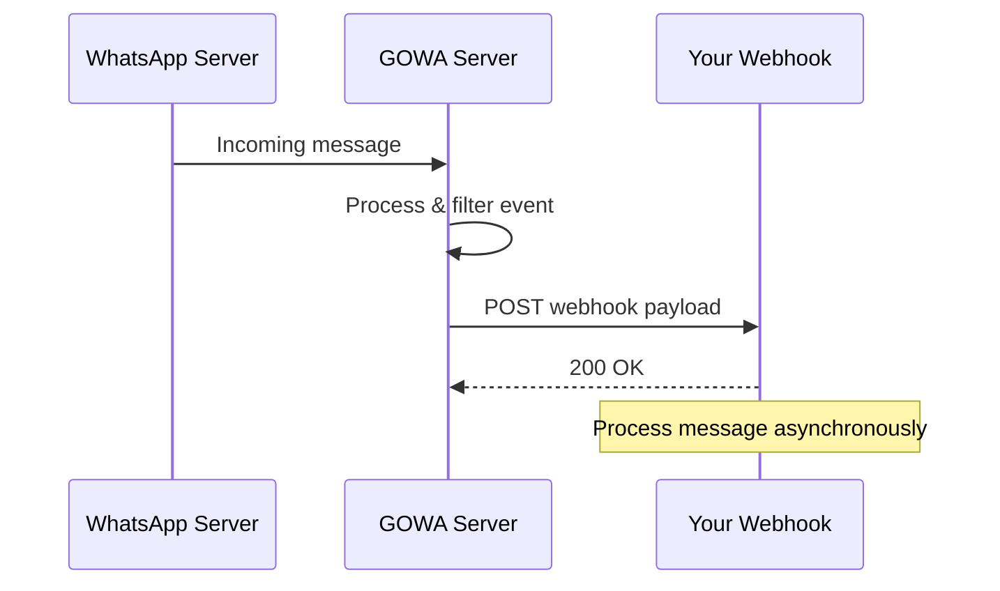

Webhooks enable your application to receive real-time notifications when WhatsApp events occur. GOWA sends HTTP POST requests to your configured webhook URL with event data in JSON format.

## How webhooks work



## Configuration

### Single webhook

<Tabs>
  <Tab title="CLI Flag">
    ```bash
    ./whatsapp rest --webhook="https://your-webhook.site/handler"
    ```
  </Tab>
  <Tab title="Environment Variable">
    ```bash
    export WHATSAPP_WEBHOOK="https://your-webhook.site/handler"
    ./whatsapp rest
    ```
  </Tab>
  <Tab title="Docker">
    ```bash
    docker run -p 3000:3000 \
      -e WHATSAPP_WEBHOOK="https://your-webhook.site/handler" \
      aldinokemal2104/go-whatsapp-web-multidevice rest
    ```
  </Tab>
</Tabs>

### Multiple webhooks

Send events to multiple endpoints (comma-separated):

```bash
--webhook="https://webhook1.com/handler,https://webhook2.com/handler"
```

Each webhook receives the same event payload.

## Event filtering

Control which events are forwarded to your webhook:

```bash
--webhook-events="message,message.ack,group.participants"
```

Or environment variable:
```bash
WHATSAPP_WEBHOOK_EVENTS=message,message.ack,group.participants
```

### Available events

| Event | Description |
|-------|-------------|
| `message` | Text, media, contact, location messages |
| `message.reaction` | Emoji reactions to messages |
| `message.revoked` | Deleted/revoked messages |
| `message.edited` | Edited messages |
| `message.ack` | Delivery and read receipts |
| `message.deleted` | Messages deleted for the user |
| `group.participants` | Group member join/leave/promote/demote |
| `group.joined` | You were added to a group |
| `newsletter.joined` | You subscribed to a newsletter |
| `newsletter.left` | You unsubscribed from a newsletter |
| `newsletter.message` | New message in a newsletter |
| `newsletter.mute` | Newsletter mute setting changed |
| `call.offer` | Incoming call received |

<Note>
If `webhook-events` is **not configured** (empty), **all events** are forwarded.
</Note>

## HMAC signature verification

Every webhook request includes an HMAC-SHA256 signature for verification.

### Configure secret

```bash
--webhook-secret="your-secret-key"
```

Default secret: `secret`

### Verify signature

<CodeGroup>
```javascript Node.js
const crypto = require('crypto');

function verifyWebhook(req, secret) {
  const signature = req.headers['x-webhook-signature'];
  const body = JSON.stringify(req.body);
  
  const hmac = crypto
    .createHmac('sha256', secret)
    .update(body)
    .digest('hex');
  
  return hmac === signature;
}

app.post('/webhook', (req, res) => {
  if (!verifyWebhook(req, 'your-secret-key')) {
    return res.status(401).send('Invalid signature');
  }
  
  // Process event
  const { event, device_id, payload } = req.body;
  console.log(`Event: ${event} from ${device_id}`);
  
  res.sendStatus(200);
});
```

```python Python
import hmac
import hashlib
import json
from flask import Flask, request

app = Flask(__name__)

def verify_webhook(request, secret):
    signature = request.headers.get('X-Webhook-Signature')
    body = json.dumps(request.json, separators=(',', ':'))
    
    hmac_obj = hmac.new(
        secret.encode('utf-8'),
        body.encode('utf-8'),
        hashlib.sha256
    )
    
    return hmac_obj.hexdigest() == signature

@app.route('/webhook', methods=['POST'])
def webhook():
    if not verify_webhook(request, 'your-secret-key'):
        return 'Invalid signature', 401
    
    data = request.json
    event = data['event']
    device_id = data['device_id']
    payload = data['payload']
    
    print(f'Event: {event} from {device_id}')
    
    return '', 200
```
</CodeGroup>

<Warning>
**Always verify signatures** in production to prevent spoofed webhook calls.
</Warning>

## Webhook payload structure

All webhook payloads follow this structure:

```json
{
  "event": "message",
  "device_id": "628123456789@s.whatsapp.net",
  "payload": {
    // Event-specific data
  }
}
```

### Message event

```json
{
  "event": "message",
  "device_id": "628123456789@s.whatsapp.net",
  "payload": {
    "id": "3EB0C0A6B4B8F8D7E9F1",
    "from": "628987654321@s.whatsapp.net",
    "timestamp": 1704067200,
    "type": "conversation",
    "body": "Hello from customer",
    "from_me": false,
    "chat_jid": "628987654321@s.whatsapp.net"
  }
}
```

### Message reaction

```json
{
  "event": "message.reaction",
  "device_id": "628123456789@s.whatsapp.net",
  "payload": {
    "message_id": "3EB0C0A6B4B8F8D7E9F1",
    "from": "628987654321@s.whatsapp.net",
    "reaction": "❤️",
    "timestamp": 1704067200
  }
}
```

### Message acknowledgment

```json
{
  "event": "message.ack",
  "device_id": "628123456789@s.whatsapp.net",
  "payload": {
    "message_id": "3EB0C0A6B4B8F8D7E9F1",
    "status": "read",
    "timestamp": 1704067200
  }
}
```

Status values:
- `server` - Delivered to server
- `delivery` - Delivered to recipient device
- `read` - Read by recipient

### Group participants event

```json
{
  "event": "group.participants",
  "device_id": "628123456789@s.whatsapp.net",
  "payload": {
    "group_jid": "120363012345678@g.us",
    "action": "add",
    "participants": [
      "628111111111@s.whatsapp.net",
      "628222222222@s.whatsapp.net"
    ],
    "timestamp": 1704067200
  }
}
```

Action values:
- `add` - Participants added
- `remove` - Participants removed
- `promote` - Promoted to admin
- `demote` - Demoted from admin

### Call offer event

```json
{
  "event": "call.offer",
  "device_id": "628123456789@s.whatsapp.net",
  "payload": {
    "from": "628987654321@s.whatsapp.net",
    "call_id": "ABCDEF123456",
    "timestamp": 1704067200,
    "is_video": false
  }
}
```

<Tip>
For complete payload schemas for all event types, see the [Webhook Payload Documentation](https://github.com/aldinokemal/go-whatsapp-web-multidevice/blob/main/docs/webhook-payload.md).
</Tip>

## Multi-device webhooks

With multiple devices, the `device_id` field identifies which account received the event:

```javascript
app.post('/webhook', (req, res) => {
  const { event, device_id, payload } = req.body;
  
  // Route by device
  switch (device_id) {
    case '628111111111@s.whatsapp.net':
      handleSalesEvent(event, payload);
      break;
    case '628222222222@s.whatsapp.net':
      handleSupportEvent(event, payload);
      break;
  }
  
  res.sendStatus(200);
});
```

## TLS certificate verification

By default, GOWA verifies TLS certificates when sending webhooks. For self-signed certificates or Cloudflare tunnels:

```bash
--webhook-insecure-skip-verify=true
```

Or environment variable:
```bash
WHATSAPP_WEBHOOK_INSECURE_SKIP_VERIFY=true
```

<Warning>
**Security warning**: Only disable TLS verification in development or when using trusted tunnels like Cloudflare. In production, use proper SSL certificates (e.g., Let's Encrypt).
</Warning>

## Retry behavior

GOWA retries failed webhook deliveries:

- **Timeout**: 30 seconds per request
- **Retry attempts**: 3 times
- **Backoff**: Exponential (1s, 2s, 4s)
- **Failed delivery**: Event is dropped after 3 attempts

<Note>
Your webhook endpoint should respond with `200 OK` within 30 seconds to avoid timeouts.
</Note>

## Best practices

<CardGroup cols={2}>
  <Card title="Respond quickly" icon="bolt">
    Return `200 OK` immediately, process events asynchronously with queues
  </Card>
  <Card title="Verify signatures" icon="shield-check">
    Always validate HMAC signatures to prevent spoofing
  </Card>
  <Card title="Filter events" icon="filter">
    Only subscribe to events you need to reduce processing overhead
  </Card>
  <Card title="Handle duplicates" icon="copy">
    Store processed message IDs to handle potential duplicate deliveries
  </Card>
</CardGroup>

## Troubleshooting

<AccordionGroup>
  <Accordion title="Webhooks not received">
    1. Check webhook URL is publicly accessible
    2. Verify `WHATSAPP_WEBHOOK` environment variable
    3. Check GOWA logs for delivery errors
    4. Test webhook endpoint with `curl`
  </Accordion>

  <Accordion title="TLS certificate errors">
    ```
    tls: failed to verify certificate: x509: certificate signed by unknown authority
    ```
    
    **Solution**: Use `--webhook-insecure-skip-verify=true` for development, or add proper SSL certificate in production.
  </Accordion>

  <Accordion title="Signature verification fails">
    1. Ensure webhook secret matches on both sides
    2. Verify you're hashing the raw JSON body (not parsed object)
    3. Check HMAC algorithm is SHA256
    4. Compare raw signature header with computed value
  </Accordion>

  <Accordion title="Missing events">
    1. Check `WHATSAPP_WEBHOOK_EVENTS` filter configuration
    2. Verify device is connected (`GET /devices/{id}/status`)
    3. Check GOWA server logs for event processing errors
  </Accordion>
</AccordionGroup>

## Next steps

<CardGroup cols={2}>
  <Card title="Webhook integration guide" icon="plug" href="/integrations/webhooks">
    Complete webhook setup tutorial
  </Card>
  <Card title="Payload schemas" icon="file-code" href="https://github.com/aldinokemal/go-whatsapp-web-multidevice/blob/main/docs/webhook-payload.md">
    Full event payload documentation
  </Card>
  <Card title="Receiving messages" icon="inbox" href="/guides/receiving-messages">
    Handle incoming messages
  </Card>
  <Card title="Configuration" icon="sliders" href="/guides/configuration">
    All webhook configuration options
  </Card>
</CardGroup>
